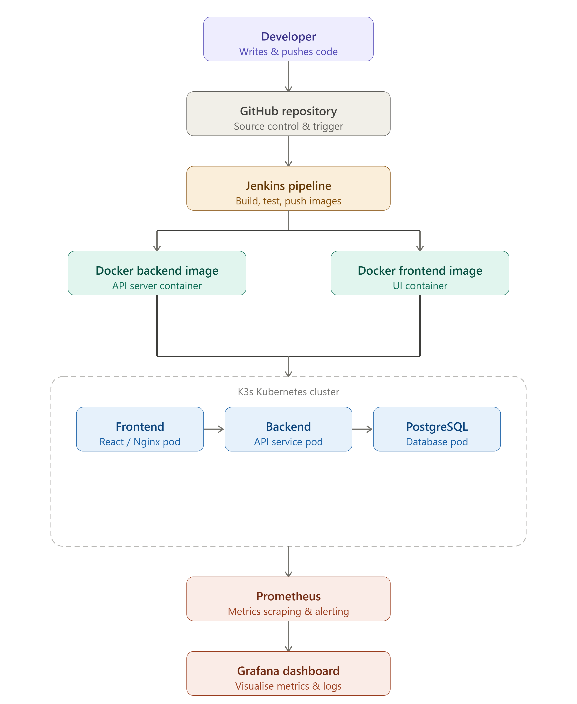
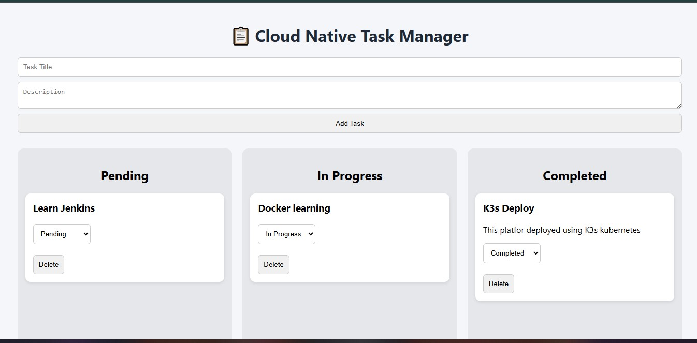
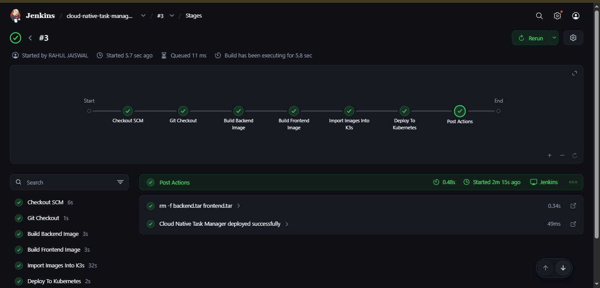
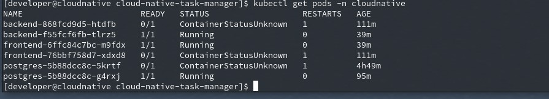

# Cloud Native Task Manager

## Overview

Cloud Native Task Manager is a full-stack task management application built using React, Flask, and PostgreSQL. The application is containerized with Docker, deployed on a K3s Kubernetes cluster, and integrated with a Jenkins CI/CD pipeline for automated builds and deployments.

## Tech Stack

* Frontend: React
* Backend: Flask
* Database: PostgreSQL
* Containerization: Docker
* CI/CD: Jenkins
* Orchestration: Kubernetes (K3s)
* Monitoring: Prometheus & Grafana

## Architecture


Developer → GitHub → Jenkins → Docker → Kubernetes → Application Services → Prometheus → Grafana

## Features

* Task creation and management
* Containerized deployment
* Kubernetes orchestration
* Automated CI/CD pipeline
* Monitoring and observability

## Screenshots

### Application UI



### Jenkins Pipeline



### Kubernetes Deployment



### Grafana Monitoring

![Grafana](screenshots/Grafana Dashboard.jpg

## Deployment

1. Clone repository
2. Build Docker images
3. Apply Kubernetes manifests
4. Access application through NodePort service

```bash
git clone <repo-url>

docker build -t cloudnative-backend ./backend

docker build -t cloudnative-frontend ./frontend

kubectl apply -f k8s/
```


## Key Achievements

- Implemented CI/CD using Jenkins Pipeline
- Containerized services with Docker
- Orchestrated application deployment using K3s Kubernetes
- Integrated PostgreSQL database
- Configured Prometheus monitoring
- Built Grafana dashboards for observability
- Implemented rolling deployments and service discovery

## Author

Rahul Jaiswal

